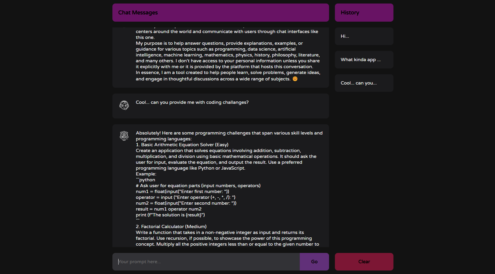

# Turbo Llama

React Based webapp that hooks to ollama when ran locally and provides a chatbot interface

Based on tutorial from: [https://www.sitepoint.com/build-chatgpt-clone-react-openai-api/](https://www.sitepoint.com/build-chatgpt-clone-react-openai-api/)

Other features added:

- history
- formatting
- ollama intrgration
- ui changes

To start you need the following:

ollama:

`ollama run mistral`

BE:

`cd api`

`python main.py`

FE: 

`npm start`

ss:

